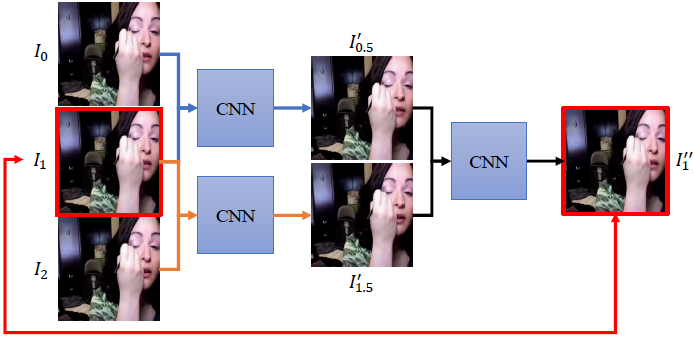

# Deep Video Frame Interpolation using Cyclic Frame Generation
Video frame interpolation algorithms predict intermediate frames to produce videos with higher frame rates and smooth view transitions given two consecutive frames as inputs. We propose that: synthesized frames are more reliable if they can be used to reconstruct the input frames with high quality. Based on this idea, we introduce a new loss term, the cycle consistency loss. The cycle consistency loss can better utilize the training data to not only enhance the interpolation results, but also maintain the performance better with less training data. It can be integrated into any frame interpolation network and trained in an end-to-end manner. In addition to the cycle consistency loss, we propose two extensions: motion linearity loss and edge-guided training. The motion linearity loss approximates the motion between two input frames to be linear and regularizes the training. By applying edge-guided training, we further improve results by integrating edge information into training. Both qualitative and quantitative experiments demonstrate that our model outperforms the state-of-the-art methods.

[[Project]](http://www.cmlab.csie.ntu.edu.tw/~yulunliu/CyclicGen) [Paper]

## Overview
This is the author's reference implementation of the video frame interpolation using TensorFlow described in:
"Deep Video Frame Interpolation using Cyclic Frame Generation"
[Yu-Lun Liu](http://www.cmlab.csie.ntu.edu.tw/~yulunliu/), [Yi-Tung Liao](http://www.cmlab.csie.ntu.edu.tw/~queenieliaw/), [Yen-Yu Lin](https://www.citi.sinica.edu.tw/pages/yylin/), [Yung-Yu Chuang](https://www.csie.ntu.edu.tw/~cyy/) (Academia Sinica & National Taiwan University & MediaTek)
in 33rd AAAI Conference on Artificial Intelligence (AAAI) 2019, Oral Presentation.
Should you be making use of our work, please cite our paper [1]. Some codes are forked from [Deep Voxel Flow (DVF)](https://github.com/liuziwei7/voxel-flow) [2] and [Holistically-Nested Edge Detection (HED)](https://github.com/moabitcoin/holy-edge) [3].



Further information please contact [Yu-Lun Liu](http://www.cmlab.csie.ntu.edu.tw/~yulunliu/).

## Requirements setup
* [TensorFlow](https://www.tensorflow.org/)

## Data Preparation
* [Deep Voxel Flow (DVF)](https://github.com/liuziwei7/voxel-flow)

## Usage
* Run the training script:
``` bash
python3 CyclicGen_train_stage1.py --subset=train
```
* Run the testing and evaluation script:
``` bash
python3 CyclicGen_train_stage1.py --subset=test
```
* Run your own pair of frames:
``` bash
python3 run.py --first=./first.png --second=./second.png --out ./out.png
```
Note that we provide two baseline models: 1) original DVF ```CyclicGen_model.py```, and 2) DVF with more layers to order to increase receptive field ```CyclicGen_model_large.py```. While test on UCF-101 dataset, we use the ```CyclicGen_model.py``` network. The motions in Middlebury dataset are much larger than UCF-101, some even exceed the receiptive field of DVF network. So we use ```CyclicGen_model_large.py``` for fine-tuning and testing. You can easily switch between these two models by changing the line ```from CyclicGen_model import Voxel_flow_model``` to ```from CyclicGen_model_large import Voxel_flow_model```.

## [video](https://www.youtube.com/watch?v=R8vQjgAtPOE)

## Citation
```
[1]  @inproceedings{liu2019cyclicgen,
         author = {Yu-Lun Liu, Yi-Tung Liao, Yen-Yu Lin, and Yung-Yu Chuang},
         title = {Deep Video Frame Interpolation using Cyclic Frame Generation},
         booktitle = {AAAI},
         year = {2019}
     }
```
```
[2]  @inproceedings{liu2017voxelflow,
         author = {Ziwei Liu, Raymond Yeh, Xiaoou Tang, Yiming Liu, and Aseem Agarwala},
         title = {Video Frame Synthesis using Deep Voxel Flow},
         booktitle = {Proceedings of International Conference on Computer Vision (ICCV)},
         month = {October},
         year = {2017} 
     }
```
```
[3]  @InProceedings{xie15hed,
         author = {"Xie, Saining and Tu, Zhuowen"},
         Title = {Holistically-Nested Edge Detection},
         Booktitle = "Proceedings of IEEE International Conference on Computer Vision",
         Year  = {2015},
     }
```

## acknowledgment
This work was supported in part by Ministry of Science and Technology (MOST) under grants MOST 107-2628-E-001-005-MY3, MOST107-2221-E-002-147-MY3, and MOST Joint Research Center for AI Technology and All Vista Healthcare under grant 107-2634-F-002-007.
